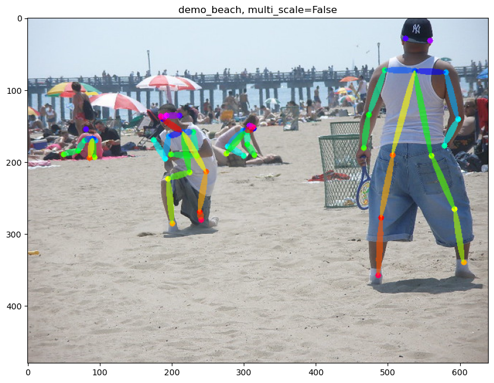
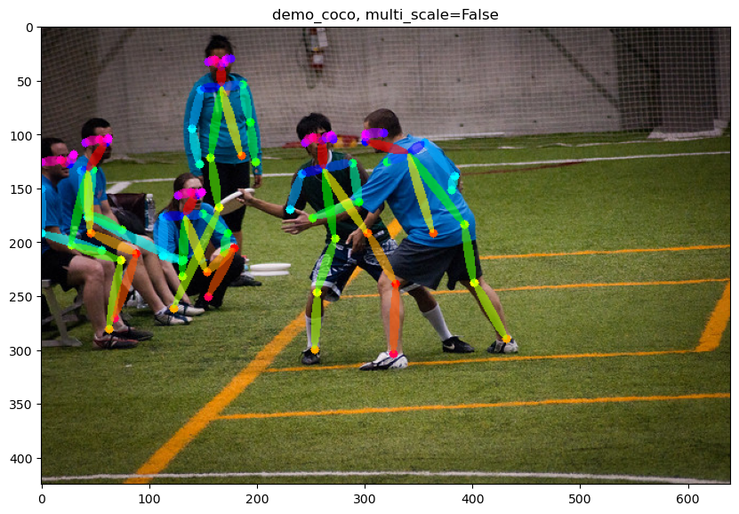
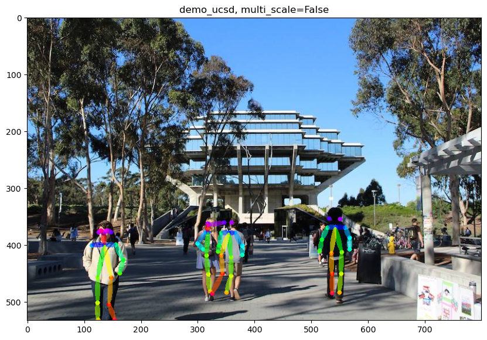
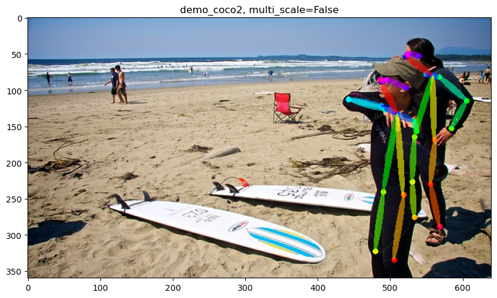

## Human Pose Estimation
Code modified from [pytorch-openpose](https://github.com/Hzzone/pytorch-openpose). This repository contains example code for [openpose](https://github.com/CMU-Perceptual-Computing-Lab/openpose).

## Examples
 | 
--|--
 | 

## Requirements
To install requirements:
```setup
pip install -r requirements.txt
```

## Pre-trained Model
Please download `body_pose_model.pth` from [Here](https://www.dropbox.com/sh/7xbup2qsn7vvjxo/AABWFksdlgOMXR_r5v3RwKRYa?dl=0). Then move `body_pose_model.pth` to `./model/`.

## Inference
To test the model, run:
```
python inference.py
```

## Reference
1. [pytorch-openpose](https://github.com/Hzzone/pytorch-openpose)
2. [openpose](https://github.com/CMU-Perceptual-Computing-Lab/openpose)


